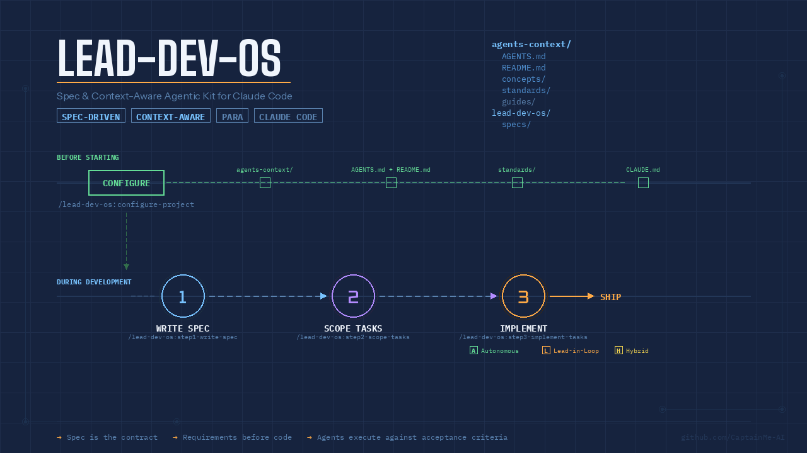

# 🚀 lead-dev-os 🚀

<p align="center">
  
</p>

[](https://github.com/CaptainMe-AI/lead-dev-os/actions/workflows/actions.yml)
[](https://captainme-ai.github.io/lead-dev-os/)


`lead-dev-os` is a spec & context-aware agentic kit for Claude Code development on large projects. It provides structured skills for product planning, spec writing, task scoping, and context-aware implementation.
The context of the project is stored under `agents-context/` directory, it is domain specific and an agent is provided only the context it needs to perform its task.

Think about it as a lead developer's main tool for guiding a team of AI agents.
A Lead Developer's primary responsibility is to ensure their team of engineers consistently moves in the right direction, making strategic decisions that benefit the entire project. By closely reviewing each engineer's progress before a feature is completed, the lead developer can identify potential issues early, address them proactively, and guarantee that the final product meets the highest standards of quality and reliability.

See [Recomendations for Development with `lead-dev-os`](#recomendations-for-development-with-lead-dev-os) for more details.

## Key Principles & Concepts

### Spec-Driven Development
- Spec is the contract, code follows
- Requirements before implementation, always
- Agents execute against testable acceptance criteria
- Eliminates ambiguity-driven rework
- Inspirations from [agent-os](https://github.com/buildermethods/agent-os) for spec-driven development, file organization and thourough prompting

### Context-aware Implementation
- **Composable** — Load only what you need for the current task
- **Self-referencing** — Concepts link to related concepts
- **Version-controlled** — Track evolution of ideas over time
- **AI-friendly** — Agents load specific concepts as context before working
- Inspirations from [agor](https://github.com/preset-io/agor) for organizing the context

### PARA for AI Agents
- [PARA method from Tiego Forte](https://www.buildingasecondbrain.com/)


## 📖 Documentation

Full documentation is available at [captainme-ai.github.io/lead-dev-os](https://captainme-ai.github.io/lead-dev-os/).

- [Installation](https://captainme-ai.github.io/lead-dev-os/installation) — Plugin setup, initialization, what gets created
- [Workflow](https://captainme-ai.github.io/lead-dev-os/workflow) — The 3-step write → scope → implement process
- [Implementation](https://captainme-ai.github.io/lead-dev-os/implementation) — Autonomous, lead-in-the-loop, and hybrid execution modes
- [Contributing](https://captainme-ai.github.io/lead-dev-os/contributing) — Testing and how to contribute

## 📦 Installation

`lead-dev-os` is distributed as a **Claude Code plugin**.

```bash
# Clone the repo (one-time)
git clone https://github.com/CaptainMe-AI/lead-dev-os.git ~/lead-dev-os

# Start Claude Code with the plugin
claude --plugin-dir ~/lead-dev-os/lead-dev-os

# Initialize in your project
/lead-dev-os:init
```

The `/lead-dev-os:init` skill will interactively set up your project — creating `agents-context/`, `specs/`, and updating your `CLAUDE.md`.

See the [Installation Guide](https://captainme-ai.github.io/lead-dev-os/installation) for full details.

## 🚀 Usage

Run the strategic skills once to set up your project, then use the tactical workflow for each feature:

```
/lead-dev-os:step1-write-spec        → Interactive Q&A + formalize into spec with numbered requirements (FR-###)
/lead-dev-os:step2-scope-tasks       → Break into task groups with context directives
/lead-dev-os:step3-implement-tasks   → Context-aware implementation of task groups
```

See the [Workflow Guide](https://captainme-ai.github.io/lead-dev-os/workflow) for the full process, and [Implementation Modes](https://captainme-ai.github.io/lead-dev-os/implementation) for autonomous, lead-in-the-loop, and hybrid execution.

## Migration from install.sh

If you previously used `scripts/install.sh`, the plugin replaces that workflow:

| Before | After |
|--------|-------|
| `scripts/install.sh` | `/lead-dev-os:init` |
| `config.default.yml` / `config.local.yml` | Interactive prompts in `/lead-dev-os:init` |
| `/step1-write-spec` | `/lead-dev-os:step1-write-spec` |
| `/step2-scope-tasks` | `/lead-dev-os:step2-scope-tasks` |
| `/step3-implement-tasks` | `/lead-dev-os:step3-implement-tasks` |
| `/plan-product` | `/lead-dev-os:plan-product` |
| `/plan-roadmap` | `/lead-dev-os:plan-roadmap` |
| `/define-standards` | `/lead-dev-os:define-standards` |

The `app/` directory and `scripts/install.sh` are deprecated but still functional for backwards compatibility.

## 🤝 Contributing

We are open to contributions — please open an issue or a pull request. See the [Contributing Guide](https://captainme-ai.github.io/lead-dev-os/contributing) for testing instructions.

## 📄 License

MIT License
